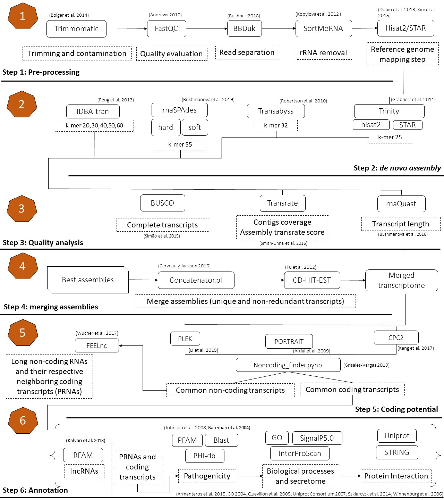

#  Pipeline  to identify pathogenicity coding RNAs and long non-coding RNAs (lncRNAs) from Dual RNA-seq libraries

This is a pipeline mainly involved in the analysis of small RNA-seq Dual libraries, coming from non-model organism, with just one replicate, low depth and genome independent. However, it's very flexible and you can take a look of the general purpose of this workflow, its scripts and contribute as well! 
 

* [Pipeline overview](#Pipeline-description):
     
    * [Step 1: Preprocessing of input data](#step1) 
      
     
    * [Step 2: *de novo* assembly of transcripts](#step2)
     
    
    * [Step 3: Transcriptome quality assessment](#step3)
     
    
    * [Step 4: Merging assemblies](#step4)
     
    
    * [Step 5: Coding potential](#step5)
     
    
    * [Step 6: Annotation](#step6)
     
* [Contact](#Contact)
    
* [References](#References)
    
* [Keynotes](#Keynote)

# Pipeline overview

# STEP 1: Preprocessing of input data

It consists in the removal of low quality information, artifacts such as adaptadors, and contamination, with Trimmomatic (Bolger et al. 2014). As this pipeline is mainly related to input data coming from RNA-seq Dual analysis, it's important to split the reads in order to get those from the host and the pathogen, separately. BBDuk (Bushnell 2018) performs very well this task by a k-mer based approach. It's also recommended to align those separated reads against several rRNA databases with SortMeRNA (Kopylova et al. 2012), in order to avoid alignment and differential expression noise. At last, if there's available a reference genome, it will be very useful for downstream analysis, if those separated and rRNA depleted reads are mapped against that genome, to assure clean reads coming only from either the pathogen or host.
 

# STEP 2: *de novo* assembly of transcripts

Different strategies of <i>de novo</i> assembly of transcripts are needed in order to appreciate the performance of various tools, even though they rely in similar principles such as de Bruijn graphs (Wang y Gribskov 2017). In this step, several <i>de novo</i> assemblers such as the well-known Trinity (Grabherr et al. 2011),  its genome-guided assembly with HISAT2 (Kim et al. 2015) and STAR (Dobin et al. 2013), rnaSPAdes (Bushmanova et al. 2019), IDBA-tran (Peng et al. 2013), and Transabyss (Robertson et al. 2010) are implemented on the clean reads with means to get several assemblies to be evaluated next.  

# STEP 3: Transcriptome quality assessment

 This step accounts for the quality analysis of each transcriptome by free-alignment software Transrate (Smith-Unna et al. 2016) and alignment-dependent software like BUSCO (Simão et al. 2015) and rnaQuast (Bushmanova et al. 2016). As there are no global parameters to rely quality on, metrics such as complete BUSCOs, contigs coverage, assembly transrate score and transcript length are assessed (Hölzer y Marz). Those assemblies with highest scores of each metric are next merged into a single assembly. 

# STEP 4: Merging assemblies

 To merge the best assemblies, the script concatenator.pl (Cerveau y Jackson 2016) and the software CD-HIT-EST (Fu et al. 2012) are implemented. They receive the transcriptome or assemblies to be merged, and their output consists of one single heteregeneuos asseembly made of unique and non-redundant transcripts. It's been seen that this approach can raise the quality of the overall transcriptome as well as retain some  unique transcripts generated by the different assembly tools (Cerveau y Jackson 2016). 

# STEP 5: Coding potential

 The coding potential of a sequence can be defined as its capacity to code for protein (Wucher et al. 2017). There are several tools that try to assess this feature by distinct approaches. Some rely on sequence intrinsic features, PLEK (Li et al. 2015), and others on protein-alignments such as CPC2 (Kang et al. 2017) and PORTRAIT (Arrial et al. 2009). In spite of the low or none coding potential of long non-coding RNAs (lncRNAs), they have a very similar structure regarding mRNAS (Huarte 2013). That's why instead of choosing one coding potential analysis tool, we aim to find the common coding and non-coding transcripts among various tools (PLEK, PORTRAIT, CPC2),  by designing a notebook  called Non-coding_finder.pynb. This approach has also been tested in Kumar et al. 2019. Last but not least, in order to assure the transcripts's coding potential, another filter is made by FEELnc (Wucher et al. 2017), to analyze once again the coding nature of the non-coding transcripts and identify some features of the lncRNAs found, like their direction, type, subtype and their neighboring coding genes.   

# STEP 6: Annotation

 After dissecting the merged transcriptome into their coding potential counterparts, one of the goals of this pipeline comes: the annotation. It consists in finding functions of each of the given sequences. First, for the lncRNAs identified, rfam-scan.pl (Kalvari et al. 2018) from the family of non-coding RNA databases (RFAM) is used. Further with the coding transcripts and the neihboring coding genes (PRNAs), Blast (Johnson et al. 2008), PFAM (Bateman et al. 2004) and the database of pathogen and host interaction (Phi-db)(Winnenburg et al. 2006) are implemented, in order to find only those transcripts related with pathogenesis itself. After having those transcripts well functionally analyzed, their biological processes are also investigated by Gene ONTOLOGY (GO) analysis (GO consortium 2004) and InterProScan (Quevillon et al. 2005). In addition, the presence of signal peptides within their sequences by SignalP5.0 (Armenteros et al. 2019) is also targeted. Finally, with those candidate pathogenicity genes, some potential protein interactions were proposed with STRING (Szklarczyk et al. 2014), by using some ID conversion with Uniprot (Uniprot consortium 2007). 

 

 <b>Annotation tools's links:</b>

[ <b>pfam-scan</b>](https://www.ebi.ac.uk/Tools/pfa/pfamscan/)
 

[ <b>rfam-scan</b>](https://rfam.xfam.org/search#tabview=tab2)
 

[ <b>blastn</b>](https://blast.ncbi.nlm.nih.gov/Blast.cgi?PAGE_TYPE=BlastSearch)
 

[ <b>Phi-blast</b>](http://www.phi-base.org/)
 

[ <b>GO</b>](http://geneontology.org/)
 

[ <b>SignalP5.0</b>](http://www.cbs.dtu.dk/services/SignalP/data.php)
 

[ <b>Uniprot</b>](https://www.uniprot.org/)
 

[ <b>STRING</b>](https://string-db.org/)
 

    

# CONTACT: 

if you want to contribute to make this pipeline better and optimizable, please contact me at: biocdgv@gmail.com. 

# Keynotes:

At this very moment, this pipeline is not automatized yet, but if you want to use any of the command lines shown, suit yourself! 

Notebook where some design ideas were borrowed: https://github.com/CompSynBioLab-KoreaUniv/FunGAP 

# REFERENCES

- Andrews, S. (2010). FastQC: a quality control tool for high throughput sequence data.
- Armenteros, J. J. A., Tsirigos, K. D., Sønderby, C. K., Petersen, T. N., Winther, O., Brunak, S., ... & Nielsen, H. (2019). SignalP 5.0 improves signal peptide predictions using deep neural networks. Nature biotechnology, 37(4), 420.
- Bolger, A. M., Lohse, M., & Usadel, B. (2014). Trimmomatic: a flexible trimmer for Illumina sequence data. Bioinformatics, 30(15), 2114-2120.
- Bushnell, B. (2018). BBTools: a suite of fast, multithreaded bioinformatics tools designed for analysis of DNA and RNA sequence data. Joint Genome Institute.
- Cerveau, N., & Jackson, D. J. (2016). Combining independent de novo assemblies optimizes the coding transcriptome for nonconventional model eukaryotic organisms. BMC bioinformatics, 17(1), 525.
- Dobin, A., Davis, C. A., Schlesinger, F., Drenkow, J., Zaleski, C., Jha, S., ... & Gingeras, T. R. (2013). STAR: ultrafast universal RNA-seq aligner. Bioinformatics, 29(1), 15-21.
- Gene Ontology Consortium. (2004). The Gene Ontology (GO) database and informatics resource. Nucleic acids research, 32(suppl_1), D258-D261.
- Grabherr, M. G., Haas, B. J., Yassour, M., Levin, J. Z., Thompson, D. A., Amit, I., ... & Chen, Z. (2011). Full-length transcriptome assembly from RNA-Seq data without a reference genome. Nature biotechnology, 29(7), 644.
- Hölzer, M., & Marz, M. (2019). De novo transcriptome assembly: A comprehensive cross-species comparison of short-read RNA-Seq assemblers. GigaScience, 8(5), giz039.
- Huarte, M. (2013). LncRNAs have a say in protein translation. Cell research, 23(4), 449.
- Kim, D., Langmead, B., & Salzberg, S. L. (2015). HISAT: a fast spliced aligner with low memory requirements. Nature methods, 12(4), 357.
- Kopylova, E., Noé, L., & Touzet, H. (2012). SortMeRNA: fast and accurate filtering of ribosomal RNAs in metatranscriptomic data. Bioinformatics, 28(24), 3211-3217.
- Kumar, H., Srikanth, K., Park, W., Lee, S. H., Choi, B. H., Kim, H., ... & Jung, J. Y. (2019). Transcriptome analysis to identify long non coding RNA (lncRNA) and characterize their functional role in back fat tissue of pig. Gene, 703, 71-82.
- Li, H., Handsaker, B., Wysoker, A., Fennell, T., Ruan, J., Homer, N., ... & Durbin, R. (2009). The sequence alignment/map format and SAMtools. Bioinformatics, 25(16), 2078-2079.
- Patro, R., Duggal, G., Love, M. I., Irizarry, R. A., & Kingsford, C. (2017). Salmon provides fast and bias-aware quantification of transcript expression. Nature methods, 14(4), 417.
- Peng, Y., Leung, H. C., Yiu, S. M., Lv, M. J., Zhu, X. G., & Chin, F. Y. (2013). IDBA-tran: a more robust de novo de Bruijn graph assembler for transcriptomes with uneven expression levels. Bioinformatics, 29(13), i326-i334.
- Quevillon, E., Silventoinen, V., Pillai, S., Harte, N., Mulder, N., Apweiler, R., & Lopez, R. (2005). InterProScan: protein domains identifier. Nucleic acids research, 33(suppl_2), W116-W120.
- Simão, F. A., Waterhouse, R. M., Ioannidis, P., Kriventseva, E. V., & Zdobnov, E. M. (2015). BUSCO: assessing genome assembly and annotation completeness with single-copy orthologs. Bioinformatics, 31(19), 3210-3212.
- Szklarczyk, D., Franceschini, A., Wyder, S., Forslund, K., Heller, D., Huerta-Cepas, J., ... & Kuhn, M. (2014). STRING v10: protein–protein interaction networks, integrated over the tree of life. Nucleic acids research, 43(D1), D447-D452.
- UniProt Consortium. (2007). The universal protein resource (UniProt). Nucleic acids research, 36(suppl_1), D190-D195.
- Smith-Unna, R., Boursnell, C., Patro, R., Hibberd, J. M., & Kelly, S. (2016). TransRate: reference-free quality assessment of de novo transcriptome assemblies. Genome research, 26(8), 1134-1144.
-  Wang, S., & Gribskov, M. (2017). Comprehensive evaluation of de novo transcriptome assembly programs and their effects on differential gene expression analysis. Bioinformatics, 33(3), 327-333.
- Arrial R, Togawa R, de M Brigido M.2009. Screening non-coding RNAs in transcriptomes from neglected species using PORTRAIT: case study of the pathogenic fungus Paracoccidioides brasiliensis. BMC bioinformatics, 10(239).
- Bateman A, Coin L, Durbin R, Finn R, Hollich V, Griffiths‐Jones S, Khanna A, Marshall M, Moxon S, Sonnhammer E, Studholme D, Yeats C, Eddy S.2004. The Pfam protein families database. Nucleic acids research, 32(1):138-141.
- Bushmanova E, Antipov D, Lapidus A, Suvorov V, Prjibelski A.2016. rnaQUAST: a quality assessment tool for de novo transcriptome assemblies.Bioinformatics, 32(14):2210-2212.
- Cerveau N, Jackson D.2016. Combining independent de novo assemblies optimizes the coding transcriptome for nonconventional model eukaryotic organisms. BMC bioinformatics, 17(1): 525. 
- Fu L, Niu B, Zhu Z, Wu S,  Li W.2012. CD-HIT: accelerated for clustering the next-generation sequencing data. Bioinformatics, 28(23):3150-3152.
- Johnson M, Zaretskaya I, Raytselis Y, Merezhuk Y, McGinnis S, Madden T. 2008. NCBI BLAST: a better web interface. Nucleic acids research, 36(2):5-9.
- Kalvari I, Nawrocki E, Argasinska J, Quinones‐Olvera N, Finn R, Bateman A, Petrov A.2018. Non‐Coding RNA Analysis Using the Rfam Database. Current protocols in bioinformatics, 62(1).
- Kang Y, Yang D, Kong L, Hou M, Meng Y, Wei L, Gao G. 2017. CPC2: a fast and accurate coding potential calculator based on sequence intrinsic features. Nucleic acids research, 45(1): 12-16.
- Simão F, Waterhouse R, Ioannidis P, Kriventseva E, Zdobnov E.2015. BUSCO: assessing genome assembly and annotation completeness with single-copy orthologs. Bioinformatics, 31(19): 3210-3212.
- Winnenburg R, Baldwin T, Urban M, Rawlings C, Köhler J, Hammond-Kosack K.2006. PHI-base: a new database for pathogen host interactions. Nucleic acids research, 34(1): 459-464.
- Wucher, V., Legeai, F., Hedan, B., Rizk, G., Lagoutte, L., Leeb, T., ... & Cirera, S. (2017). FEELnc: a tool for long non-coding RNA annotation and its application to the dog transcriptome. Nucleic acids research, 45(8), e57-e57.
- Robertson, G., Schein, J., Chiu, R., Corbett, R., Field, M., Jackman, S. D., ... & Griffith, M. (2010). De novo assembly and analysis of RNA-seq data. Nature methods, 7(11), 909.

